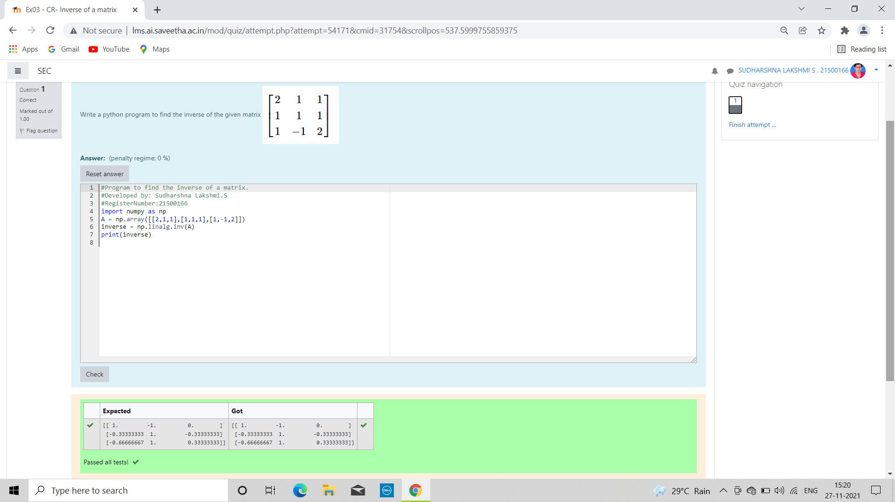

# INVERSE-OF-A-MATRIX
## Aim:
To write a python program to find the inverse of a matrix
## Equipment’s required:
1. 	Hardware – PCs
2. 	Anaconda – Python 3.7 Installation / Moodle-Code Runner
## Algorithm:
### Step1 :
Import the numpy module to use the built-in functions for calculation. 
### Step 2: 
Prepare the lists for each linear equations and assign array in np.array().
### Step 3: 
Using the np.linagl.inv(A),we can find the solutions.
### Step 4: 
End the program.
### Step 5:
WOW! You got the output. Now,it's time to celebrate.

## Program:
```
#Program to find the inverse of a matrix
#Developed by: Sudharshna Lakshmi.S
#RegisterNumber:21500166
import numpy as np
A = np.array([[2,1,1],[1,1.1],[1,-1,2]])
inverse = np.linalg.inv(A)
print(inverse)

```

## Output:


## Result:
Thus the inverse of given matrix is successfully solved using python program

